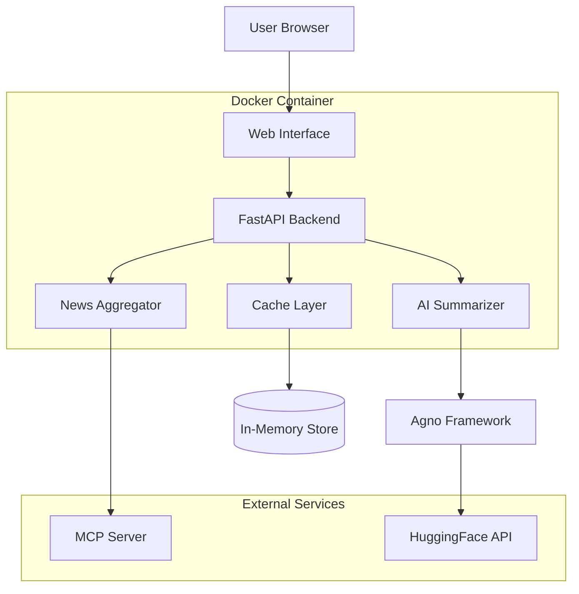
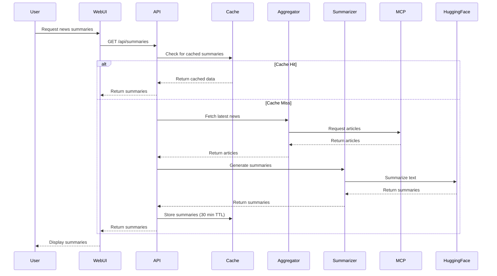
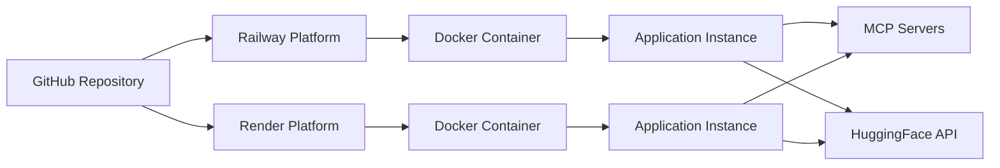

# Technical Design Document: AI News Summarizer

## Overview

The AI News Summarizer is a containerized web application that provides users with AI-generated summaries of the latest world news. The system architecture follows a three-tier design pattern with clear separation between data retrieval, AI processing, and presentation layers.

### System Architecture

The application consists of five primary components:

1. **News Aggregator**: Fetches news articles from MCP (Model Context Protocol) Servers
2. **AI Summarizer**: Generates concise summaries using HuggingFace models via the Agno framework
3. **Web Interface**: Presents summaries through a responsive, visually appealing frontend
4. **Cache Layer**: Stores processed summaries to optimize API usage and response times
5. **Container Manager**: Handles Docker containerization and deployment configuration

### Technology Stack

- **Backend Framework**: Python with FastAPI for REST API endpoints
- **AI Orchestration**: Agno framework for managing AI agent workflows
- **NLP Models**: HuggingFace Transformers (facebook/bart-large-cnn for summarization)
- **Frontend**: HTML5, CSS3, JavaScript with a modern CSS framework (Tailwind CSS)
- **Data Source**: MCP Servers for news feeds
- **Caching**: In-memory cache with TTL (Time To Live) management
- **Containerization**: Docker with multi-stage builds
- **Deployment**: Railway and Render platform support

### Design Principles

- **Separation of Concerns**: Each component has a single, well-defined responsibility
- **Fail-Safe Operations**: Graceful degradation when external services are unavailable
- **Performance First**: Caching and concurrent processing to minimize latency
- **Configuration-Driven**: Environment variables for all deployment-specific settings
- **Container-Native**: Designed for ephemeral container environments

## Architecture

### High-Level Architecture Diagram



### Component Interaction Flow



### Deployment Architecture



## Components and Interfaces

### 1. News Aggregator Component

**Responsibility**: Fetch and normalize news articles from MCP Servers

**Interface**:
```python
class NewsAggregator:
    def __init__(self, mcp_server_url: str, retry_delay: int = 60):
        """Initialize with MCP server configuration"""
        
    async def fetch_latest_news(self) -> List[Article]:
        """Fetch articles from the last 24 hours"""
        
    async def connect_to_mcp(self) -> bool:
        """Establish connection to MCP server with retry logic"""
        
    def schedule_updates(self, interval_minutes: int = 30):
        """Schedule periodic news fetching"""
```

**Key Behaviors**:
- Connects to MCP Server on initialization
- Implements retry logic with 60-second delay on connection failures
- Fetches news every 30 minutes via background scheduler
- Filters articles to last 24 hours
- Normalizes article metadata (title, source, date, content)

### 2. AI Summarizer Component

**Responsibility**: Generate concise summaries using Agno and HuggingFace

**Interface**:
```python
class AISummarizer:
    def __init__(self, agno_config: dict, hf_token: str):
        """Initialize Agno framework and HuggingFace client"""
        
    async def summarize_article(self, article: Article) -> Summary:
        """Generate 50-150 word summary preserving key facts"""
        
    async def batch_summarize(self, articles: List[Article]) -> List[Summary]:
        """Process multiple articles concurrently (up to 50)"""
        
    def _extract_key_facts(self, summary: str) -> dict:
        """Validate presence of who, what, when, where, why"""
```

**Key Behaviors**:
- Uses Agno framework to orchestrate summarization workflow
- Calls HuggingFace API (facebook/bart-large-cnn model)
- Enforces 50-150 word summary length
- Processes articles within 5 seconds each
- Implements exponential backoff for rate limits
- Returns fallback message on summarization failure

### 3. Web Interface Component

**Responsibility**: Display news summaries with responsive, attractive design

**Interface**:
```python
# FastAPI endpoints
@app.get("/")
async def index():
    """Serve main HTML page"""

@app.get("/api/summaries")
async def get_summaries() -> List[SummaryResponse]:
    """Return current news summaries with metadata"""

@app.get("/api/health")
async def health_check():
    """Health check endpoint for deployment platforms"""
```

**Frontend Structure**:
```html
<!-- Card-based layout -->
<div class="summary-card">
    <div class="category-icon"></div>
    <h2 class="article-title"></h2>
    <div class="metadata">
        <span class="source"></span>
        <span class="timestamp"></span>
        <span class="category"></span>
    </div>
    <p class="summary-text"></p>
</div>
```

**Key Behaviors**:
- Responsive design (320px - 2560px width)
- Card-based layout with hover effects
- Color coding by news category
- Typography hierarchy for readability
- Displays source, time, and category metadata
- Shows last update timestamp
- Loads within 3 seconds
- User-friendly error messages

### 4. Cache Layer Component

**Responsibility**: Store and manage cached summaries

**Interface**:
```python
class CacheManager:
    def __init__(self, ttl_minutes: int = 30):
        """Initialize cache with TTL configuration"""
        
    async def get(self, key: str) -> Optional[Any]:
        """Retrieve cached value if not expired"""
        
    async def set(self, key: str, value: Any, ttl: Optional[int] = None):
        """Store value with TTL"""
        
    async def invalidate(self, key: str):
        """Remove cached value"""
        
    def is_expired(self, key: str) -> bool:
        """Check if cached value has expired"""
```

**Key Behaviors**:
- In-memory storage for fast access
- 30-minute TTL for summaries
- Automatic expiration and cleanup
- Thread-safe operations for concurrent access

### 5. Container Manager Component

**Responsibility**: Docker containerization and configuration management

**Configuration Interface**:
```python
class Config:
    # Required environment variables
    HUGGINGFACE_TOKEN: str
    MCP_SERVER_URL: str
    
    # Optional with defaults
    PORT: int = 8080
    CACHE_TTL_MINUTES: int = 30
    NEWS_REFRESH_MINUTES: int = 30
    MAX_CONCURRENT_SUMMARIES: int = 50
    MEMORY_LIMIT_MB: int = 512
    
    @classmethod
    def validate(cls):
        """Validate all required config is present"""
```

**Key Behaviors**:
- Reads configuration from environment variables
- Validates required variables at startup
- Fails fast with descriptive errors if config missing
- Exposes web service on configurable port
- Limits memory usage to 512MB
- Supports health check endpoints

## Data Models

### Article Model

```python
from datetime import datetime
from typing import Optional
from pydantic import BaseModel, HttpUrl

class Article(BaseModel):
    """Raw news article from MCP Server"""
    id: str
    title: str
    source: str
    publication_date: datetime
    content: str
    url: HttpUrl
    category: Optional[str] = None
    
    class Config:
        json_encoders = {
            datetime: lambda v: v.isoformat()
        }
```

### Summary Model

```python
from datetime import datetime
from typing import Optional
from pydantic import BaseModel, Field

class Summary(BaseModel):
    """AI-generated summary with metadata"""
    article_id: str
    title: str
    summary_text: str = Field(..., min_length=50, max_length=150)
    source: str
    publication_date: datetime
    category: Optional[str] = None
    generated_at: datetime
    key_facts: dict  # who, what, when, where, why
    
    class Config:
        json_encoders = {
            datetime: lambda v: v.isoformat()
        }
```

### SummaryResponse Model

```python
from datetime import datetime
from pydantic import BaseModel

class SummaryResponse(BaseModel):
    """API response format for frontend"""
    id: str
    title: str
    summary: str
    source: str
    published: str  # Human-readable format
    category: str
    timestamp: datetime
    last_updated: datetime
```

### CacheEntry Model

```python
from datetime import datetime
from typing import Any, Generic, TypeVar

T = TypeVar('T')

class CacheEntry(Generic[T]):
    """Cache entry with TTL tracking"""
    value: T
    created_at: datetime
    ttl_seconds: int
    
    def is_expired(self) -> bool:
        """Check if entry has exceeded TTL"""
        age = (datetime.utcnow() - self.created_at).total_seconds()
        return age > self.ttl_seconds
```

### Error Models

```python
from enum import Enum
from pydantic import BaseModel

class ErrorSeverity(str, Enum):
    INFO = "INFO"
    WARNING = "WARNING"
    ERROR = "ERROR"
    CRITICAL = "CRITICAL"

class ErrorLog(BaseModel):
    """Structured error logging"""
    timestamp: datetime
    component: str
    severity: ErrorSeverity
    message: str
    details: Optional[dict] = None
    
class UserError(BaseModel):
    """User-facing error response"""
    message: str
    retry_after: Optional[int] = None  # seconds
```

### Configuration Model

```python
from pydantic import BaseSettings, validator

class AppConfig(BaseSettings):
    """Application configuration from environment"""
    
    # Required
    huggingface_token: str
    mcp_server_url: str
    
    # Optional with defaults
    port: int = 8080
    cache_ttl_minutes: int = 30
    news_refresh_minutes: int = 30
    max_concurrent_summaries: int = 50
    memory_limit_mb: int = 512
    log_level: str = "INFO"
    
    @validator('huggingface_token', 'mcp_server_url')
    def validate_required(cls, v):
        if not v:
            raise ValueError("Required configuration missing")
        return v
    
    class Config:
        env_file = ".env"
        case_sensitive = False
```


## Correctness Properties

A property is a characteristic or behavior that should hold true across all valid executions of a system—essentially, a formal statement about what the system should do. Properties serve as the bridge between human-readable specifications and machine-verifiable correctness guarantees.

### Property 1: 24-Hour Article Filtering

For any set of articles returned by the News Aggregator, all articles must have publication dates within the last 24 hours from the current time.

**Validates: Requirements 1.2**

### Property 2: Article Metadata Completeness

For any article retrieved by the News Aggregator, the article must contain all required metadata fields: title, source, publication_date, and content, with none of these fields being null or empty.

**Validates: Requirements 1.3**

### Property 3: Summary Word Count Constraint

For any article processed by the AI Summarizer, the generated summary text must contain between 50 and 150 words (inclusive).

**Validates: Requirements 2.3**

### Property 4: Key Facts Preservation

For any article containing identifiable key facts (who, what, when, where, why), the generated summary must preserve these key facts in a verifiable form.

**Validates: Requirements 2.4**

### Property 5: Summary Processing Time

For any single article, the AI Summarizer must complete processing and return a summary within 5 seconds.

**Validates: Requirements 2.6**

### Property 6: Responsive Layout Integrity

For any viewport width between 320px and 2560px (inclusive), the Web Interface must render without horizontal scrolling or layout breakage, and all content must remain accessible.

**Validates: Requirements 3.3**

### Property 7: Summary Display Metadata Completeness

For any summary displayed in the Web Interface, the rendered card must include all three required metadata elements: article source, publication time, and category.

**Validates: Requirements 3.6**

### Property 8: Configuration Environment Variable Support

For any configuration value defined in the AppConfig model, the Container Manager must successfully read that value from environment variables, and for any required configuration value that is missing or invalid, the system must fail startup with a descriptive error message identifying the specific configuration issue.

**Validates: Requirements 4.4, 7.1, 7.5, 7.6**

### Property 9: Error Log Structure

For any error that occurs in any component, the system must generate a log entry containing all required fields: timestamp, component name, severity level (INFO, WARNING, ERROR, or CRITICAL), error message, and optional details.

**Validates: Requirements 8.1, 8.3**

### Property 10: User Error Message Safety

For any error message displayed to users through the Web Interface, the message must not contain technical implementation details such as stack traces, internal variable names, or system paths.

**Validates: Requirements 8.5**

### Property 11: Article Display Ordering

For any list of articles displayed in the Web Interface, the articles must be ordered by publication date in descending order (newest first).

**Validates: Requirements 9.5**

## Error Handling

### Error Categories and Strategies

The system implements a layered error handling approach with specific strategies for each component:

#### 1. External Service Failures

**MCP Server Connection Errors**:
- Strategy: Retry with exponential backoff
- Initial retry: 60 seconds after first failure
- Maximum retries: 5 attempts
- Fallback: Display cached content with staleness indicator
- Logging: ERROR level with connection details

**HuggingFace API Errors**:
- Rate Limiting (429): Exponential backoff starting at 1 second, doubling each retry
- Service Unavailable (503): Retry after delay specified in Retry-After header
- Authentication (401): CRITICAL log and fail fast (configuration issue)
- Timeout: Retry up to 3 times with 10-second timeout
- Fallback: Display article title with "Summary unavailable" message

#### 2. Data Validation Errors

**Invalid Article Data**:
- Missing required fields: Log WARNING and skip article
- Invalid date format: Attempt parsing with multiple formats, skip if all fail
- Empty content: Log WARNING and skip article
- Malformed URLs: Log WARNING but continue processing

**Invalid Configuration**:
- Missing required variables: CRITICAL log and exit with code 1
- Invalid format (e.g., non-numeric port): CRITICAL log and exit with code 1
- Invalid URLs: CRITICAL log and exit with code 1

#### 3. Processing Errors

**Summarization Failures**:
- Model errors: Log ERROR, return fallback message
- Timeout: Log WARNING, retry once, then fallback
- Invalid output: Log ERROR, attempt regeneration once, then fallback

**Cache Errors**:
- Memory pressure: Evict oldest entries using LRU strategy
- Serialization errors: Log ERROR and skip caching for that item
- Corruption: Clear cache and rebuild

#### 4. Resource Constraints

**Memory Limits**:
- Approaching limit (>450MB): Trigger cache cleanup
- Exceeded limit (>512MB): Reject new requests with 503 status
- Log WARNING at 400MB, ERROR at 480MB

**Concurrent Request Limits**:
- Queue requests beyond 50 concurrent summaries
- Queue size limit: 200 requests
- Queue full: Return 503 with Retry-After header
- Request timeout in queue: 30 seconds

### Error Response Formats

**API Error Response**:
```json
{
  "error": {
    "message": "Unable to fetch news at this time",
    "code": "SERVICE_UNAVAILABLE",
    "retry_after": 60
  }
}
```

**User-Facing Error Messages**:
- "Unable to load news summaries. Please try again in a moment."
- "Some summaries are temporarily unavailable."
- "News content is currently being updated. Please refresh shortly."

### Logging Standards

**Log Format**:
```json
{
  "timestamp": "2024-01-15T10:30:45.123Z",
  "component": "AI_Summarizer",
  "severity": "ERROR",
  "message": "Summarization failed for article",
  "details": {
    "article_id": "abc123",
    "error_type": "TimeoutError",
    "retry_count": 2
  }
}
```

**Log Levels**:
- INFO: Normal operations (startup, scheduled tasks, cache hits)
- WARNING: Recoverable issues (skipped articles, cache misses, retries)
- ERROR: Failed operations with fallback (summarization failures, API errors)
- CRITICAL: System-level failures requiring intervention (config errors, startup failures)

**Log Rotation**:
- Container environment: Logs to stdout only
- No file-based logging (ephemeral storage)
- Rely on platform log aggregation (Railway/Render)

## Testing Strategy

### Overview

The testing strategy employs a dual approach combining unit tests for specific scenarios and property-based tests for comprehensive validation of universal properties. This ensures both concrete correctness and general robustness across the input space.

### Property-Based Testing

**Framework**: Hypothesis (Python)

**Configuration**:
- Minimum 100 iterations per property test
- Deadline: 10 seconds per test case
- Random seed: Configurable for reproducibility
- Shrinking: Enabled for minimal failing examples

**Property Test Implementation**:

Each correctness property from the design document must be implemented as a property-based test with appropriate generators:

**Property 1: 24-Hour Article Filtering**
```python
# Feature: ai-news-summarizer, Property 1: 24-Hour Article Filtering
@given(articles=st.lists(article_generator()))
@settings(max_examples=100)
def test_24_hour_filtering(articles):
    """For any set of articles returned, all must be within 24 hours"""
    aggregator = NewsAggregator(mcp_url="mock://test")
    filtered = aggregator.filter_recent(articles)
    
    now = datetime.utcnow()
    for article in filtered:
        age_hours = (now - article.publication_date).total_seconds() / 3600
        assert age_hours <= 24
```

**Property 2: Article Metadata Completeness**
```python
# Feature: ai-news-summarizer, Property 2: Article Metadata Completeness
@given(article=article_generator())
@settings(max_examples=100)
def test_article_metadata_completeness(article):
    """For any retrieved article, all required fields must be present"""
    assert article.title and len(article.title) > 0
    assert article.source and len(article.source) > 0
    assert article.publication_date is not None
    assert article.content and len(article.content) > 0
```

**Property 3: Summary Word Count Constraint**
```python
# Feature: ai-news-summarizer, Property 3: Summary Word Count Constraint
@given(article=article_generator(min_content_words=200))
@settings(max_examples=100, deadline=timedelta(seconds=10))
async def test_summary_word_count(article):
    """For any article, summary must be 50-150 words"""
    summarizer = AISummarizer(config=test_config)
    summary = await summarizer.summarize_article(article)
    
    word_count = len(summary.summary_text.split())
    assert 50 <= word_count <= 150
```

**Property 6: Responsive Layout Integrity**
```python
# Feature: ai-news-summarizer, Property 6: Responsive Layout Integrity
@given(viewport_width=st.integers(min_value=320, max_value=2560))
@settings(max_examples=100)
def test_responsive_layout(viewport_width):
    """For any viewport width 320-2560px, layout must not break"""
    browser = setup_test_browser(width=viewport_width)
    browser.get("http://localhost:8080")
    
    # Check no horizontal scroll
    assert browser.execute_script("return document.body.scrollWidth") <= viewport_width
    
    # Check all cards are visible
    cards = browser.find_elements_by_class("summary-card")
    for card in cards:
        assert card.is_displayed()
```

**Property 8: Configuration Environment Variable Support**
```python
# Feature: ai-news-summarizer, Property 8: Configuration Environment Variable Support
@given(config_dict=configuration_generator())
@settings(max_examples=100)
def test_configuration_validation(config_dict):
    """For any configuration, required values must be validated"""
    if "huggingface_token" not in config_dict or not config_dict["huggingface_token"]:
        with pytest.raises(ValueError, match="Required configuration missing"):
            AppConfig(**config_dict)
    else:
        config = AppConfig(**config_dict)
        assert config.huggingface_token == config_dict["huggingface_token"]
```

**Property 11: Article Display Ordering**
```python
# Feature: ai-news-summarizer, Property 11: Article Display Ordering
@given(articles=st.lists(article_generator(), min_size=2, max_size=50))
@settings(max_examples=100)
def test_article_ordering(articles):
    """For any list of articles, they must be ordered newest first"""
    ordered = sort_articles_for_display(articles)
    
    for i in range(len(ordered) - 1):
        assert ordered[i].publication_date >= ordered[i + 1].publication_date
```

### Unit Testing

**Framework**: pytest with pytest-asyncio

**Focus Areas**:
- Specific edge cases not covered by properties
- Integration points between components
- Error handling scenarios
- Mock external services (MCP, HuggingFace)

**Example Unit Tests**:

```python
def test_mcp_connection_retry_on_failure():
    """Test retry logic when MCP server is unavailable"""
    aggregator = NewsAggregator(mcp_url="http://unreachable:9999")
    
    with patch('time.sleep') as mock_sleep:
        result = aggregator.connect_to_mcp()
        
        assert result is False
        assert mock_sleep.called
        assert aggregator.retry_count == 1

async def test_summarization_fallback_on_error():
    """Test fallback message when summarization fails"""
    summarizer = AISummarizer(config=test_config)
    article = Article(title="Test", content="x" * 10000)  # Oversized
    
    with patch.object(summarizer, '_call_huggingface', side_effect=TimeoutError):
        summary = await summarizer.summarize_article(article)
        
        assert "Summary unavailable" in summary.summary_text
        assert summary.article_id == article.id

def test_cache_expiration():
    """Test that cache entries expire after TTL"""
    cache = CacheManager(ttl_minutes=30)
    cache.set("test_key", "test_value")
    
    # Simulate time passage
    with patch('datetime.datetime') as mock_datetime:
        mock_datetime.utcnow.return_value = datetime.utcnow() + timedelta(minutes=31)
        
        assert cache.is_expired("test_key")
        assert cache.get("test_key") is None

def test_docker_image_size():
    """Test that built Docker image is under 1GB"""
    result = subprocess.run(
        ["docker", "images", "ai-news-summarizer", "--format", "{{.Size}}"],
        capture_output=True,
        text=True
    )
    
    size_str = result.stdout.strip()
    # Parse size (e.g., "850MB" or "0.85GB")
    if "GB" in size_str:
        size_gb = float(size_str.replace("GB", ""))
        assert size_gb < 1.0
    elif "MB" in size_str:
        size_mb = float(size_str.replace("MB", ""))
        assert size_mb < 1000
```

### Integration Testing

**Scope**: End-to-end workflows with mocked external services

```python
@pytest.mark.integration
async def test_full_news_pipeline():
    """Test complete flow from fetching to display"""
    # Setup mocks
    mock_mcp = MockMCPServer(articles=generate_test_articles(10))
    mock_hf = MockHuggingFace()
    
    # Initialize system
    app = create_app(mcp_url=mock_mcp.url, hf_token="test")
    
    # Trigger news fetch
    await app.aggregator.fetch_latest_news()
    
    # Verify summaries generated
    summaries = await app.get_summaries()
    assert len(summaries) == 10
    
    # Verify all properties hold
    for summary in summaries:
        assert 50 <= len(summary.summary_text.split()) <= 150
        assert summary.source
        assert summary.category
```

### Performance Testing

**Load Testing**:
- Tool: Locust
- Scenarios:
  - 100 concurrent users requesting summaries
  - Sustained load for 10 minutes
  - Verify response times < 3 seconds
  - Verify memory stays < 512MB

**Stress Testing**:
- Gradually increase load to find breaking point
- Verify graceful degradation (queuing)
- Verify no memory leaks over extended runs

### Test Coverage Goals

- Unit test coverage: >80% of code
- Property test coverage: 100% of correctness properties
- Integration test coverage: All major workflows
- Critical paths: 100% coverage (error handling, configuration validation)

### Continuous Integration

**CI Pipeline** (GitHub Actions):
1. Run unit tests on every commit
2. Run property tests on every PR
3. Run integration tests on main branch
4. Build Docker image and verify size
5. Deploy to staging on main branch merge
6. Run smoke tests on staging
7. Manual approval for production deploy

**Test Execution Time Targets**:
- Unit tests: < 2 minutes
- Property tests: < 5 minutes
- Integration tests: < 3 minutes
- Total CI pipeline: < 15 minutes
